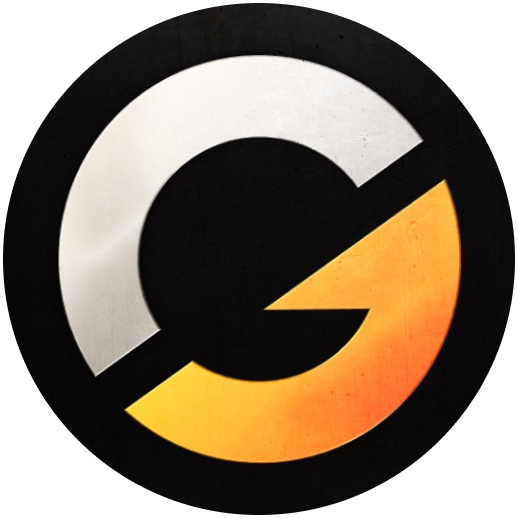
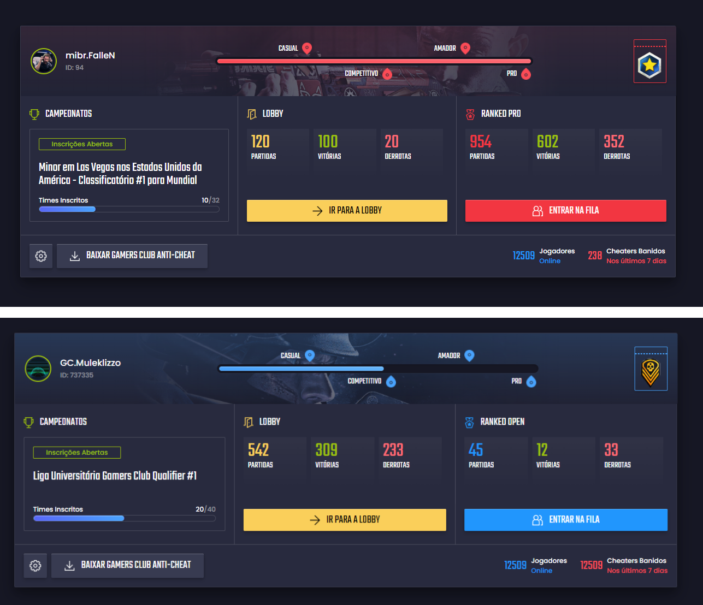

<h1 align="center">
    
</h1>

<h4 align="center">
  🚀 GamersClub
</h4>

  

  
  
  

  

  

  <a href="#rocket-tecnologias">Tecnologias</a>&nbsp;&nbsp;&nbsp;|&nbsp;&nbsp;&nbsp;
  <a href="#-projeto">Projeto</a>&nbsp;&nbsp;&nbsp;|&nbsp;&nbsp;&nbsp;
  <a href="#-como-contribuir">Como contribuir</a>&nbsp;&nbsp;&nbsp;|&nbsp;&nbsp;&nbsp;
  <a href="#memo-licença">Licença</a>

 

  

## :rocket: Tecnologias

Esse projeto foi desenvolvido com a seguinte tecnologia:

- [React](https://facebook.github.io/react/)

## 💻 Projeto

GC!

Jogue CS:GO na Gamers Club. Os melhores servidores para você jogar CSGO. Jogue na Ranked e ganhe prêmios em skin e dinheiro. Seja Premium e tenha benefícios. CS:GO é na Gamers Club!

## 🎮 Start

- Passo 1: Utilize o comando `yarn install || só yarn` para instalar as dependências do projeto;

- Passo 2: Utilize o comando `yarn start` para inicializar o projeto;

- Passo 3: Caso não tenha seu ambiente configurado para rodar o site [clique aqui](https://nodejs.org/en/) instale a versão atualizada do Node, instale o yarn e volte para o passo 1.

Obs: Você pode utilizar o gerenciador de pacotes que desejar NPM OU YARN. 🥳

## 🎨 Figma

Figma disponível [clique aqui.](https://www.figma.com/file/cGn5cJIVfIraVm2wCioIlp/Frontend-Application?node-id=0%3A1)

## 🤔 Como contribuir

- Faça um fork desse repositório;
- Cria uma branch com a sua feature: `git checkout -b minha-feature`;
- Faça commit das suas alterações: `git commit -m 'feat: Minha nova feature'`;
- Faça push para a sua branch: `git push origin minha-feature`.

Depois que o merge da sua pull request for feito, você pode deletar a sua branch.

## 🤯 Observações

Devido a correria do trabalho não tive muito tempo para finalizar o desafio 100%, mas dei meu melhor e espero que gostem. 😊

## :memo: Licença

Esse projeto está sob a licença MIT. Veja o arquivo [LICENSE](LICENSE.md) para mais detalhes.

---

Feito com ♥ by Daniel Jerônimo :wave: [Entre em contato!](https://www.linkedin.com/in/danielgjl/)
